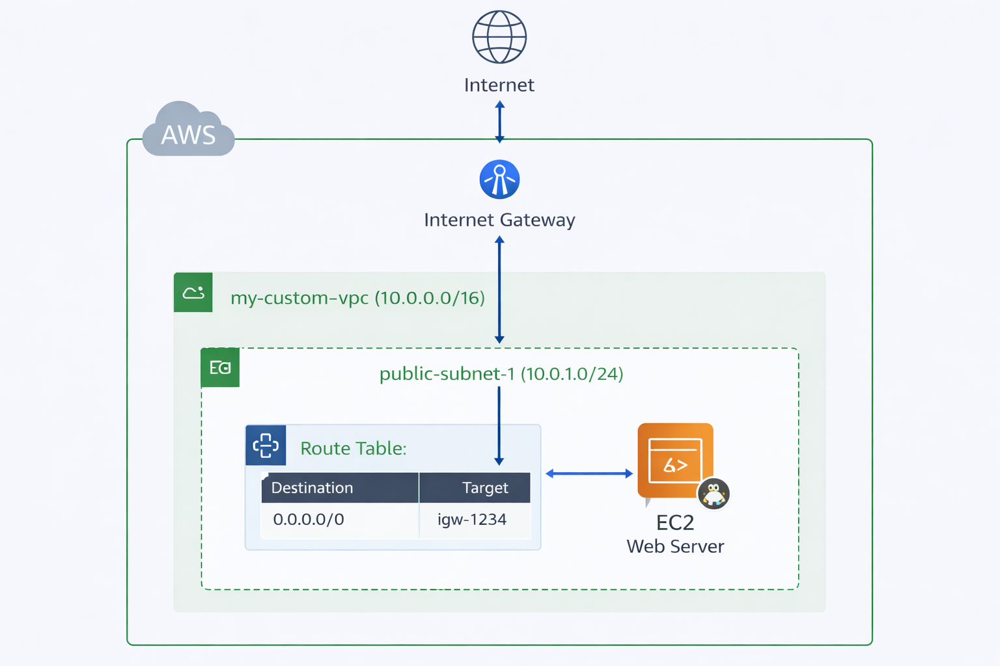
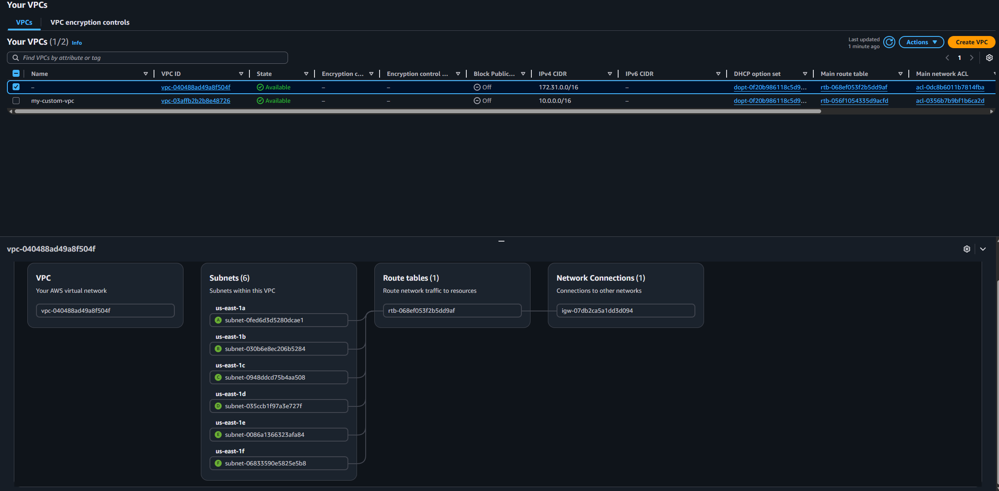
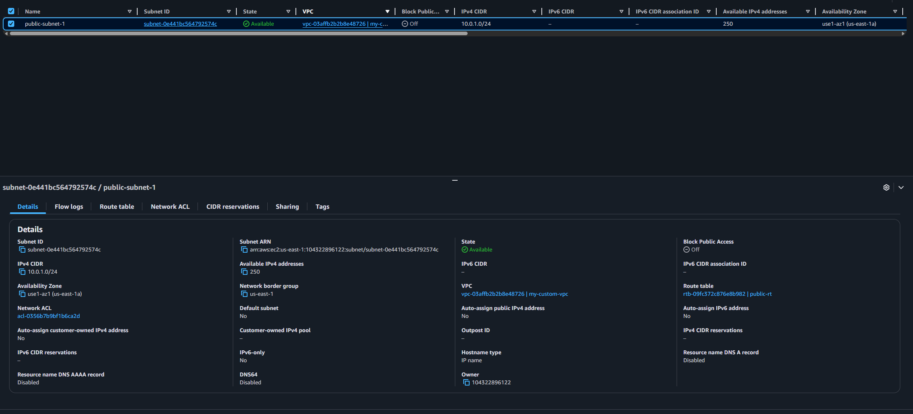
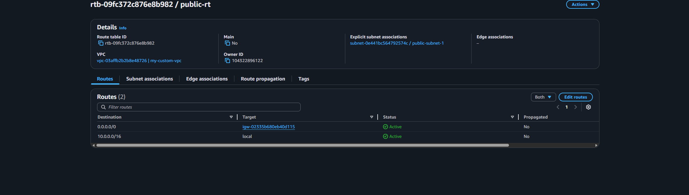
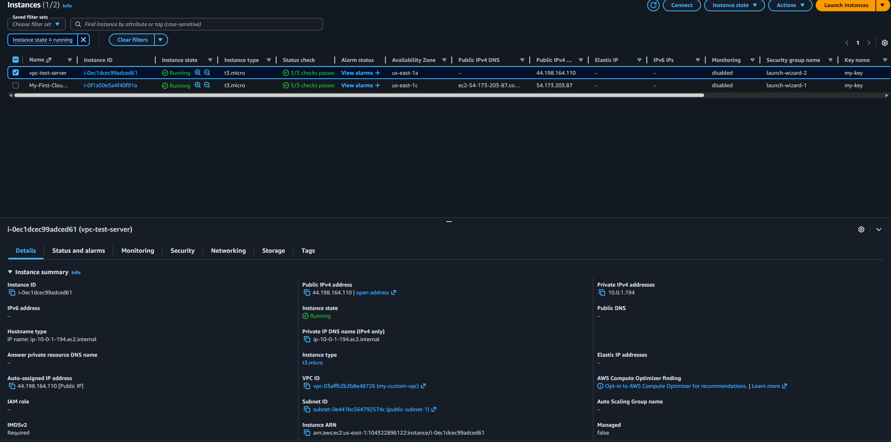

# aws-custom-vpc-lab
Designed and implemented a custom AWS VPC with public subnet, Internet Gateway, and route table configuration, deploying an EC2 instance to validate end-to-end internet connectivity.
# AWS Custom VPC Lab

## Overview
Designed and deployed a custom Virtual Private Cloud (VPC) in AWS to simulate a real-world cloud network architecture, including public subnet routing and internet access.

## Architecture
- Custom VPC (10.0.0.0/16)
- Public Subnet (10.0.1.0/24)
- Internet Gateway
- Custom Route Table with default route (0.0.0.0/0)
- EC2 instance deployed in public subnet

## What I Did
- Created a custom VPC with a defined CIDR block
- Designed and configured a public subnet
- Attached an Internet Gateway to enable external connectivity
- Configured route tables to allow outbound internet access
- Associated subnet with route table to make it public
- Launched an EC2 instance within the custom VPC
- Configured security groups (SSH + HTTP)
- Installed and ran Apache web server to validate connectivity

## Technologies Used
- AWS VPC
- AWS EC2
- Linux (Amazon Linux)
- Apache (httpd)
- Networking concepts (CIDR, routing, subnets)

## Result
Successfully deployed a web server inside a custom VPC and verified internet connectivity via public IP access.

## What I Learned
- How to design and configure cloud network infrastructure
- Differences between default and custom VPCs
- Subnet segmentation and routing behavior
- Internet Gateway and route table relationships
- Real-world troubleshooting of SSH and connectivity issues

## Architecture Diagram

## Screenshots

### VPC Resource Map

### Subnet Configuration

### Route Table

### EC2 Instance

